# Network Traffic Investigation & Suspicious Activity Detection using Wireshark

## Project Overview

This project demonstrates practical network traffic analysis using Wireshark in a Kali Linux virtual machine environment. Multiple protocols including ICMP, DNS, HTTP, TCP, TLS, Ethernet, IPv4, and UDP were analyzed to understand packet communication and SOC-style traffic investigation workflows.

---

# Tools Used

- Wireshark
- Kali Linux
- VMware Workstation
- Linux Terminal
- GitHub
- Visual Studio Code

---

# Objectives

- Capture and analyze live network traffic
- Understand TCP/IP communication
- Investigate packet behavior and protocol flow
- Learn Wireshark filtering techniques
- Practice SOC-style traffic investigation

---

# ICMP Traffic Analysis

## Command Used

```bash
ping google.com
```

## Wireshark Filter

```text
icmp
```

## Findings

- ICMP Echo Request packets observed
- ICMP Echo Reply packets received successfully
- Source and destination communication verified
- RTT (Round Trip Time) behavior analyzed

## Terminal Screenshot

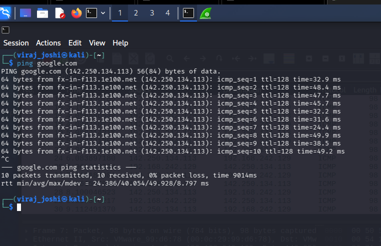

## ICMP Packet Analysis

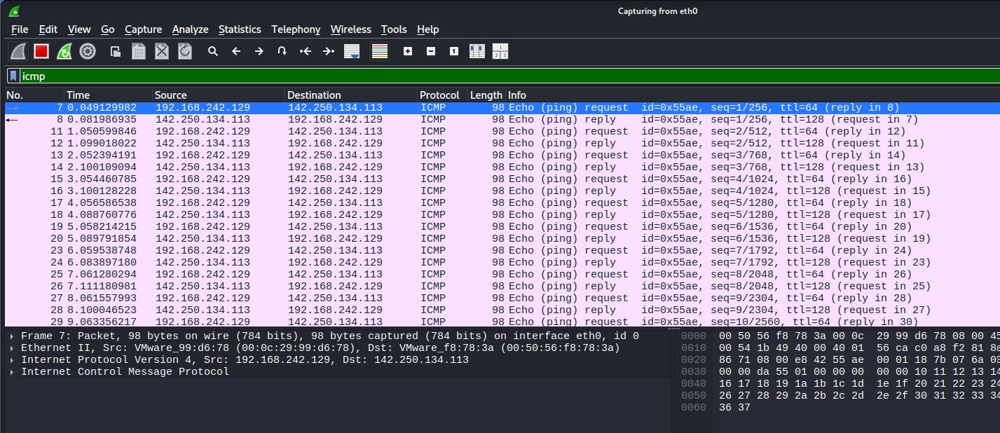

---

# DNS Traffic Analysis

## Filter Used

```text
dns
```

## Findings

- DNS queries and responses captured successfully
- A and AAAA DNS records observed
- Domain resolution process analyzed
- Multiple DNS transactions identified

## DNS Packet Analysis

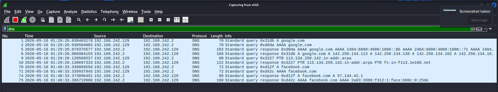

---

# HTTP Traffic Analysis

## Command Used

```bash
curl http://facebook.com
```

## Wireshark Filter

```text
http
```

## Findings

- HTTP GET request captured
- HTTP 301 redirect response observed
- Client-server communication analyzed
- Clear-text HTTP traffic identified before HTTPS redirection

## HTTP Packet Analysis

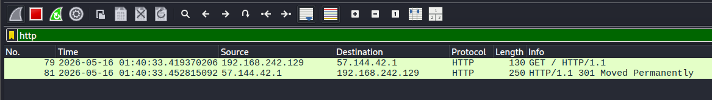

---

# TCP Packet Analysis

## Filter Used

```text
tcp
```

## Findings

- TCP communication packets analyzed
- ACK, FIN, SYN, and PSH flags identified
- Packet flow between source and destination reviewed
- TCP session behavior observed

## TCP Packet Screenshot

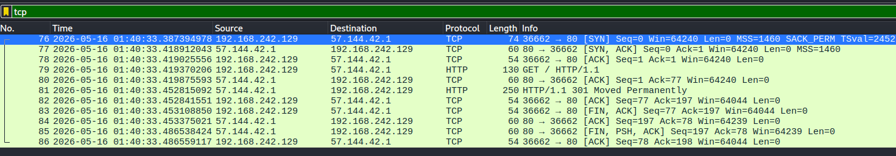

---

# TCP SYN Packet Analysis

## Filter Used

```text
tcp.flags.syn == 1 && tcp.flags.ack == 0
```

## Findings

- Initial SYN packet identified
- TCP connection initiation analyzed
- Source and destination port communication verified
- Beginning stage of TCP handshake observed

## SYN Packet Screenshot

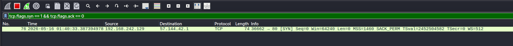

---

# TCP 3-Way Handshake Analysis

## Findings

- SYN packet initiated communication
- SYN-ACK packet returned from server
- ACK packet completed TCP handshake
- Successful TCP connection establishment verified

## TCP Handshake Screenshot

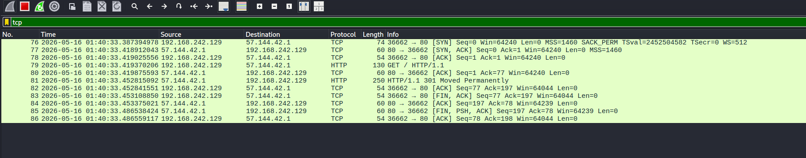

---

# Follow TCP Stream Analysis

## Findings

- HTTP communication stream reconstructed
- HTTP GET request inspected
- HTTP 301 redirect response analyzed
- Full client-server data exchange reviewed

## Follow TCP Stream Screenshot

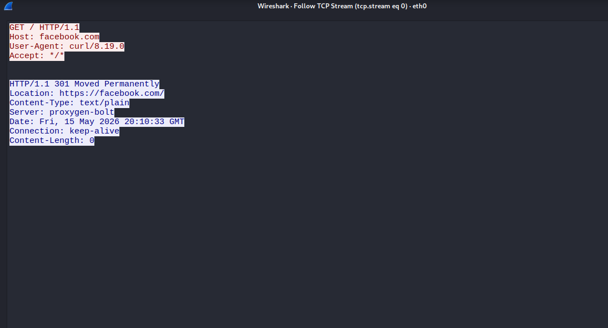

---

# Ethernet Conversation Analysis

## Findings

- Ethernet-level communication analyzed
- MAC address traffic reviewed
- Packet transmission between devices verified
- Ethernet conversation statistics inspected

## Ethernet Conversation Screenshot

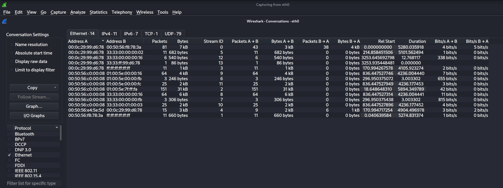

---

# IPv4 Conversation Analysis

## Findings

- IPv4 communication flows analyzed
- Source and destination IP addresses identified
- Packet and byte statistics reviewed
- Multiple communication endpoints observed

## IPv4 Conversation Screenshot

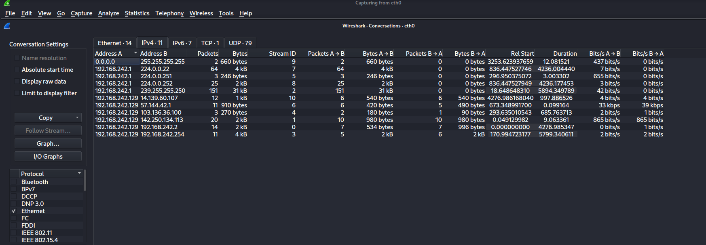

---

# TCP Conversation Analysis

## Findings

- TCP conversation statistics analyzed
- HTTP port 80 traffic identified
- Packet exchange duration reviewed
- Bidirectional communication behavior observed

## TCP Conversation Screenshot

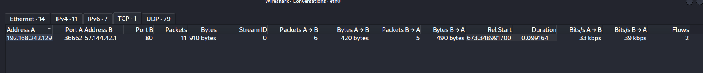

---

# UDP Conversation Analysis

## Findings

- UDP multicast and broadcast traffic analyzed
- Connectionless communication behavior observed
- Packet statistics reviewed
- Multiple UDP streams identified

## UDP Conversation Screenshot

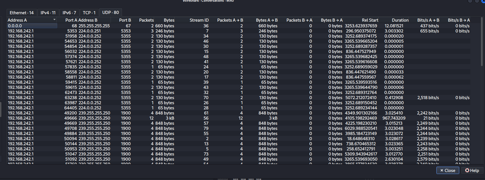

---

# PCAP Files Included

| PCAP File | Description |
|---|---|
| `icmp_ping_capture.pcapng` | ICMP Echo Request and Reply traffic |
| `dns_lookup_capture.pcapng` | DNS query and response traffic |
| `http_traffic_capture.pcapng` | HTTP GET request and response traffic |
| `tcp_handshake_capture.pcapng` | TCP 3-way handshake traffic |
| `tls_traffic_capture.pcapng` | TLS/HTTPS encrypted traffic |

---

# Project Folder Structure

```text
SOC-Network-Analysis-Project/
│
├── README.md
│
├── screenshots/
│   ├── conversions_eth0.png
│   ├── conversions_ipv4.png
│   ├── conversions_tcp.png
│   ├── conversions_UDP.png
│   ├── dns.png
│   ├── follow_tcp_stream.png
│   ├── http.png
│   ├── icmp.png
│   ├── ping_command.png
│   ├── tcp.png
│   ├── tcp_handshake.png
│   └── tcp_handshake_syn.png
│
├── pcap/
│   ├── icmp_ping_capture.pcapng
│   ├── dns_lookup_capture.pcapng
│   ├── http_traffic_capture.pcapng
│   ├── tcp_handshake_capture.pcapng
│   └── tls_traffic_capture.pcapng
```

---

# Skills Gained

- Packet analysis
- Wireshark filtering
- TCP/IP fundamentals
- ICMP investigation
- DNS analysis
- HTTP traffic inspection
- TCP handshake analysis
- Ethernet and IPv4 analysis
- UDP traffic investigation
- SOC-style network traffic analysis

---

# Conclusion

This project provided practical experience in capturing and analyzing real-world network traffic using Wireshark within a Kali Linux virtual environment. Multiple protocols including ICMP, DNS, HTTP, TCP, TLS, Ethernet, IPv4, and UDP were investigated to understand communication behavior, packet structure, and network analysis methodologies used in SOC environments.